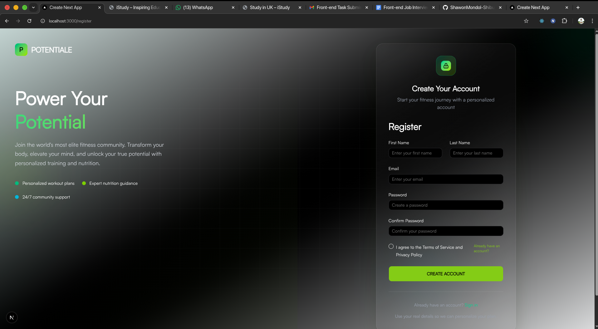
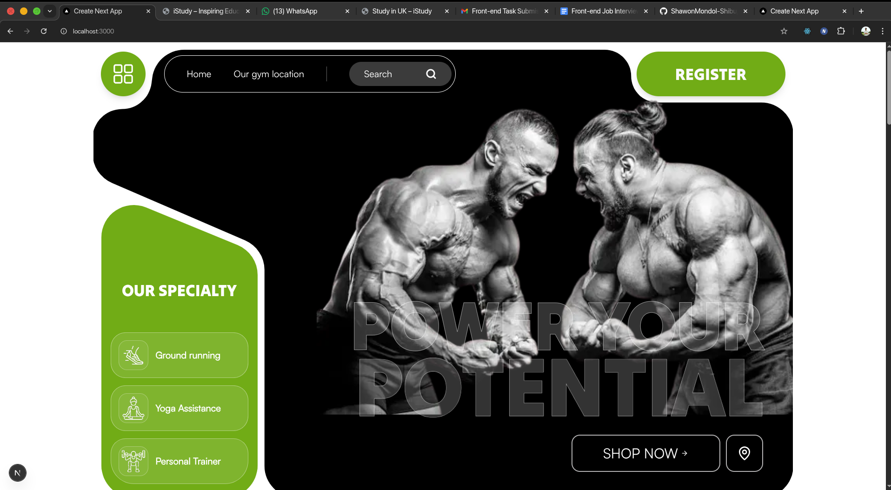

***

# 🚀 Power Your Potential

A professional, high-performance web application built with the **Next.js 16 App Router**. This project features a modular architecture, custom-built UI components, and fluid animations, all developed within a **Fedora Linux** environment.


## ✨ Key Features

- **Authentication System:** Dedicated `(auth)` routes for Login and Registration.
- **User Profile:** Profile management under the `(pages)` route group.
- **Modular UI:** A highly organized component system with `shared` layouts and `ui` primitives.
- **Modern Styling:** Powered by **Tailwind CSS v4** and **Shadcn UI**.
- **Smooth Animations:** Integrated **Framer Motion** for production-grade transitions.
- **Form Validation:** Type-safe form handling using **React Hook Form** and **Zod**.
- **Performance:** Optimized images and custom font loading via `assets/fonts`.

## 🛠️ Tech Stack

- **Framework:** [Next.js 16 (App Router)](https://nextjs.org/)
- **Language:** [TypeScript](https://www.typescriptlang.org/)
- **UI & Components:** [Shadcn UI](https://ui.shadcn.com/), [Base UI](https://base-ui.com/)
- **Icons:** [Lucide React](https://lucide.dev/), [React Icons](https://react-icons.github.io/react-icons/)
- **Styling:** [Tailwind CSS 4](https://tailwindcss.com/)
- **Animations:** [Framer Motion](https://www.framer.com/motion/)
- **Data Visualization:** [Recharts](https://recharts.org/)

## 📂 Project Structure

```text
├── app/
│   ├── (auth)/           # Login and Register routes
│   ├── (pages)/          # Profile and main application pages
│   ├── globals.css       # Tailwind 4 global styles
│   └── layout.tsx        # Root layout
├── assets/
│   └── fonts/            # Custom project fonts
├── components/
│   ├── shared/           # Reusable layouts (Navbar, Footer, etc.)
│   ├── product/          # Product-specific components
│   └── ui/               # Shadcn / Base UI primitives
├── hooks/                # Custom React hooks
├── lib/
│   ├── validations/      # Zod schemas for form validation
│   ├── animation.ts      # Framer Motion variants & configs
│   ├── data.ts           # Static/Mock data
│   └── utils.ts          # Helper functions (cn, etc.)
└── public/
    └── images/           # Asset management (Clients, Products, SVGs)
```

## 💻 Development Environment

- **OS:** Fedora Linux
- **IDE:** VS Code
- **Browser:** Google Chrome (DevTools optimized)

## 🚀 Getting Started

### Installation

1. **Clone the repository:**
   ```bash
   git clone https://github.com/ShawonMondol-Shibu/power-your-potentiale.git
   ```

2. **Install dependencies:**
   ```bash
   bun install
   ```

3. **Run the development server:**
   ```bash
   bun run dev
   ```

4. **View the app:**
   Open [http://localhost:3000](http://localhost:3000) in your browser.

## 📸 Screenshots

| Auth Screens | Main Home |
| :---: | :---: |
|  |  |

## 👤 Author

**Shawon Mondol Shibu**
*   GitHub: [@shawonmondol-shibu](https://github.com/ShawonMondol-Shibu)

---
*Developed with precision on Fedora Linux.*

